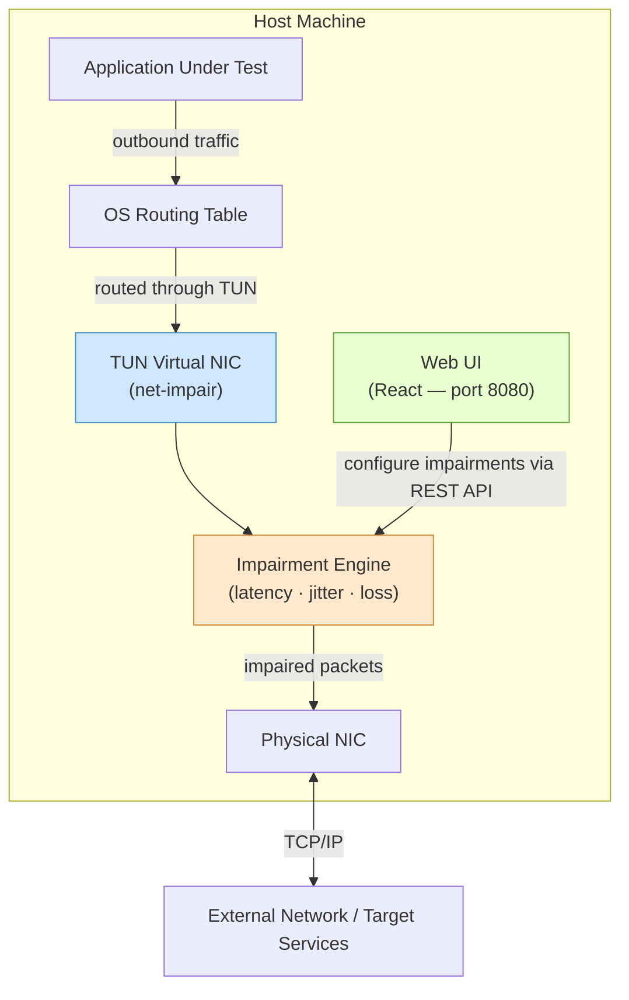

# Architecture Diagrams

All diagrams are written in [Mermaid](https://mermaid.js.org/) and embedded directly in this file.

> **Viewing:** VS Code renders these with the [Markdown Preview Mermaid Support](https://marketplace.visualstudio.com/items?itemName=bierner.markdown-mermaid) extension. GitHub renders them natively.

## System Overview

High-level component view of the running system.

