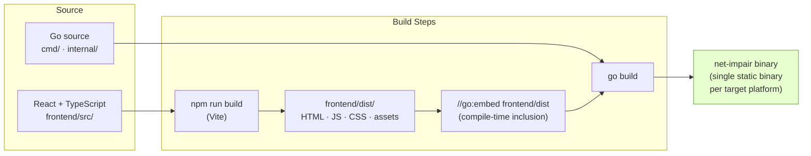
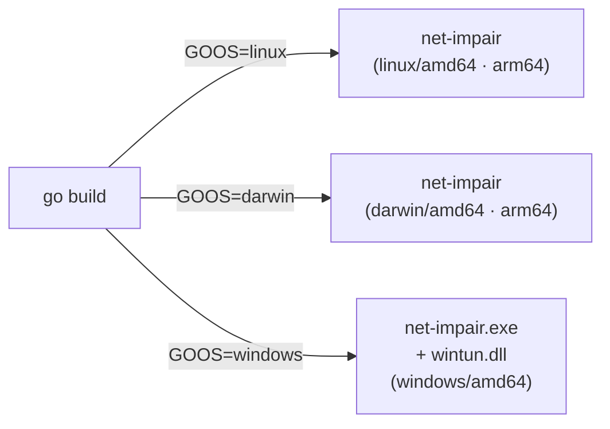

# Build Pipeline

The frontend is compiled at build time and embedded directly into the Go binary via `//go:embed`. The resulting binary is fully self-contained — no separate web server or runtime dependency is required.

Related: [ADR-001](../decisions/ADR-001-language-golang.md) · [ADR-003](../decisions/ADR-003-frontend-react-vite.md)

## Cross-Platform Targets

