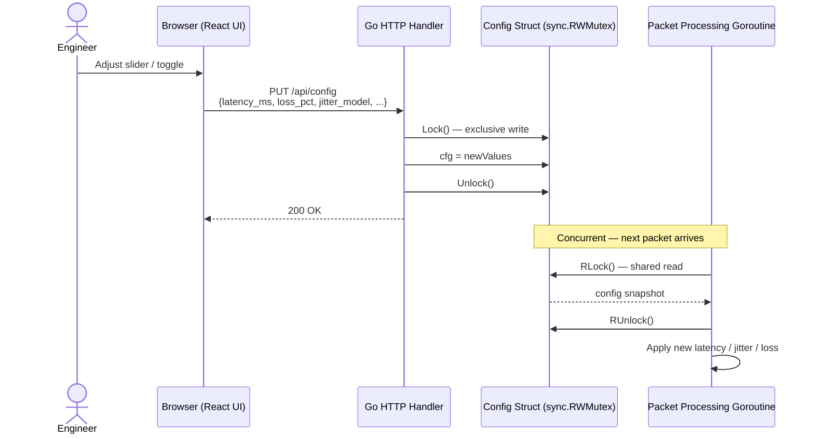

# Live Configuration Update

Sequence for changing impairment parameters via the web UI while the proxy is running. Changes take effect immediately on the next packet processed — there is no per-connection state or drain period.

Related: [ADR-006](../decisions/ADR-006-live-configuration-changes.md)

> **Note**: individual packets already in OS buffers when the config write occurs may still complete with the prior timing, but no batching or drain logic is required — correctness is guaranteed at the struct level.
