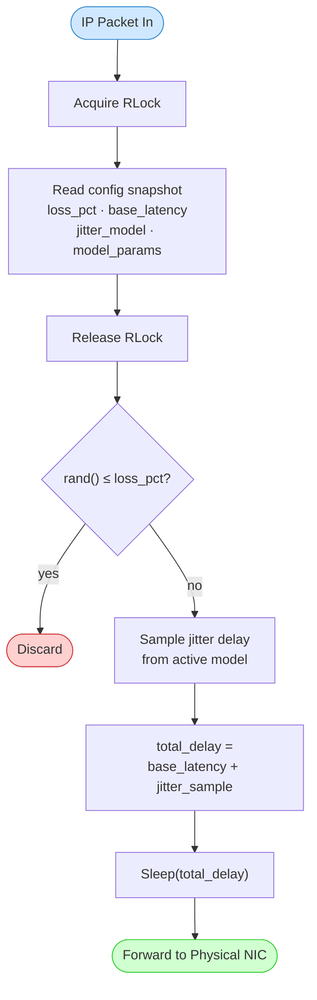
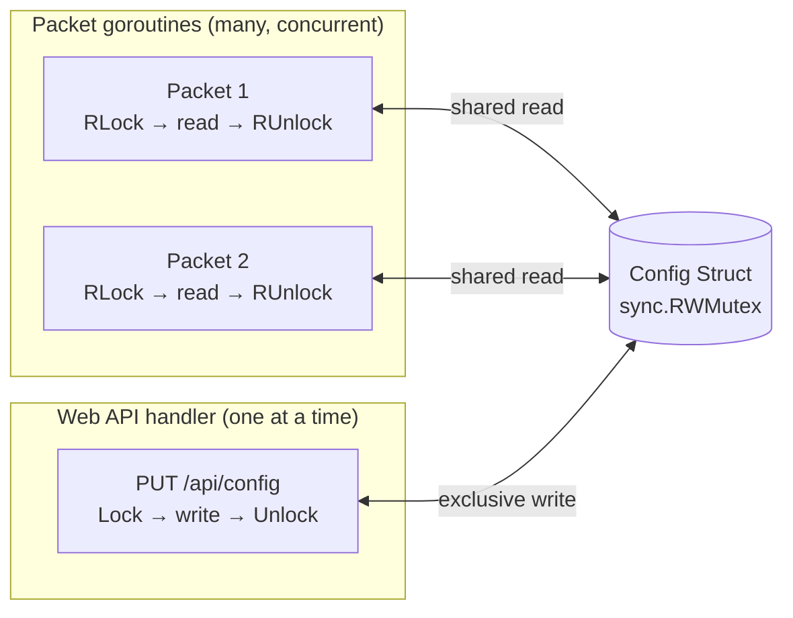

# Impairment Engine

Per-packet processing pipeline inside the impairment engine. The config struct is read under a shared read lock so config updates from the web UI never block packet processing for longer than a single struct read.

Related: [ADR-004](../decisions/ADR-004-impairment-granularity-global-v1.md) · [ADR-005](../decisions/ADR-005-jitter-distribution-models.md) · [ADR-006](../decisions/ADR-006-live-configuration-changes.md)

## Config Struct — Concurrent Access

