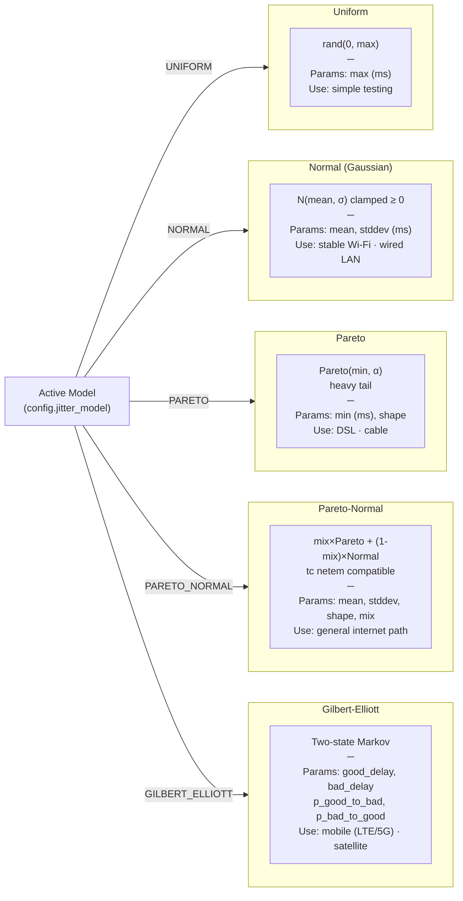
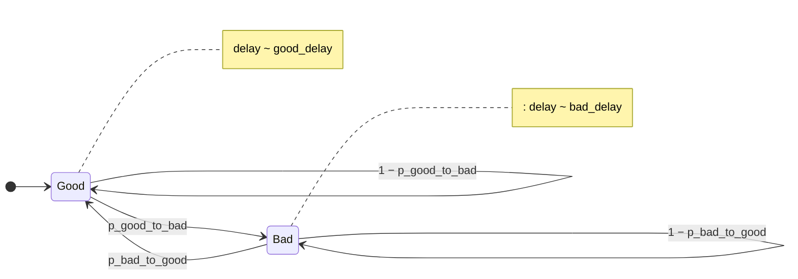

# Jitter Distribution Models

The active jitter model is selected in the web UI. Each model is independently testable and exposes only its relevant parameters.

Related: [ADR-005](../decisions/ADR-005-jitter-distribution-models.md)

## Model Selection

## Gilbert-Elliott State Machine

The Gilbert-Elliott model is the only stateful model — it maintains a current state across packets to produce correlated, bursty behavior.

