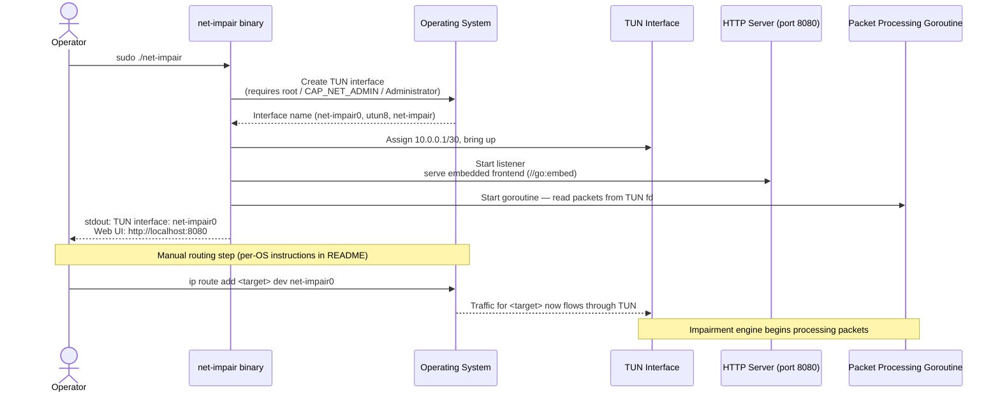

# Startup Sequence

Initialization steps from binary launch to ready state. After the tool prints its ready message, the operator must manually add OS routing rules to direct target traffic through the TUN interface.

Related: [ADR-002](../decisions/ADR-002-proxy-approach-tun-virtual-nic.md) · [ADR-003](../decisions/ADR-003-frontend-react-vite.md)

