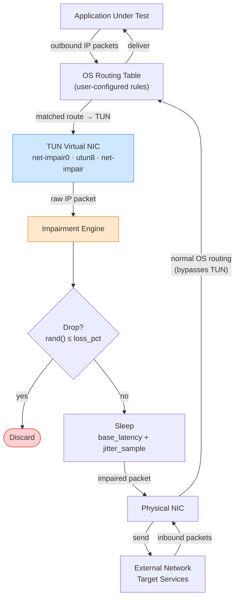

# TUN Packet Flow

End-to-end path of an outbound IP packet from the application through the impairment engine to the network. Return (inbound) traffic follows normal OS routing and bypasses the TUN interface.

Related: [ADR-002](../decisions/ADR-002-proxy-approach-tun-virtual-nic.md)

